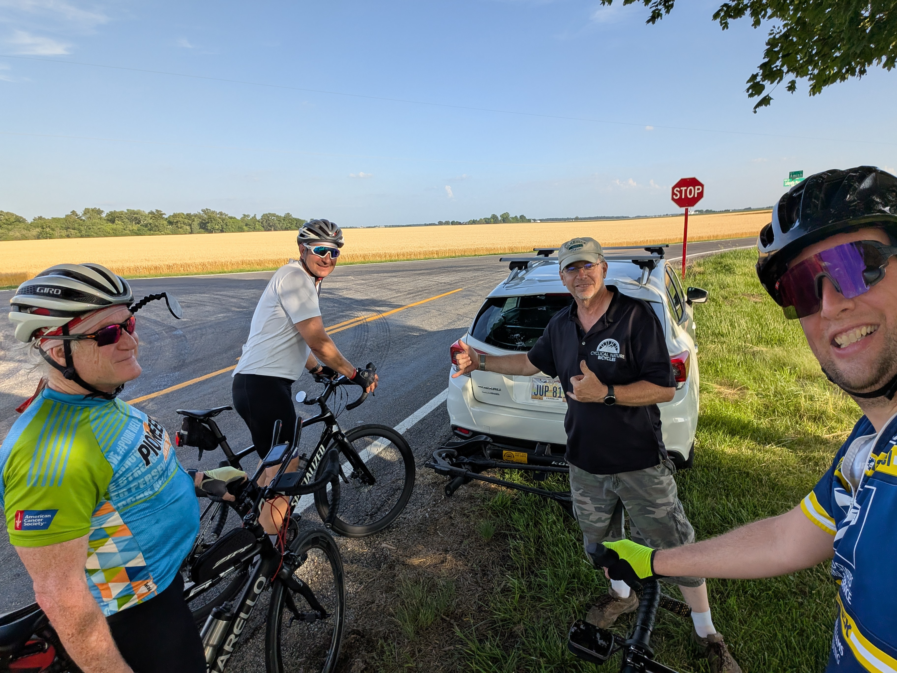
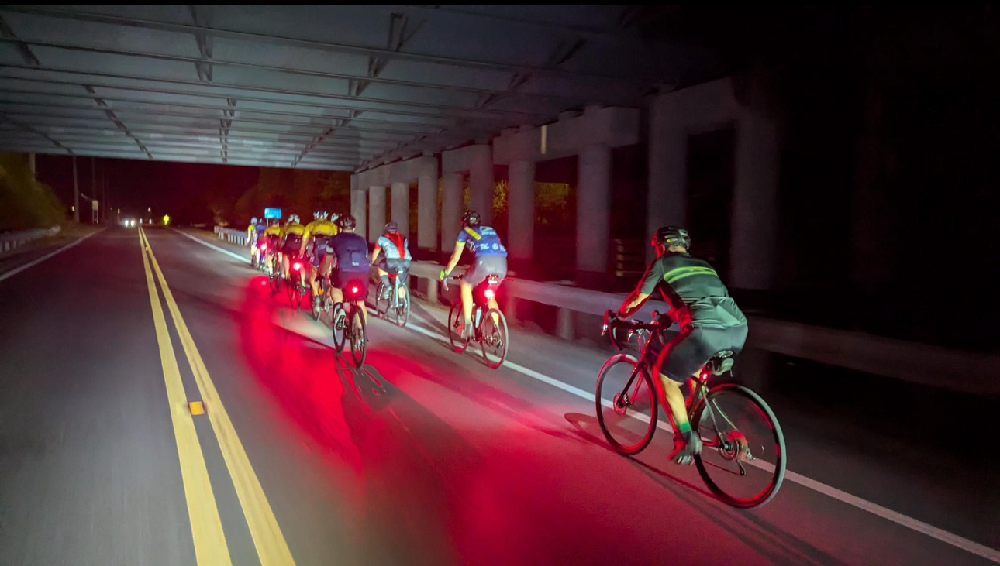

## The ride leader

One of my favorite things in cycling is being a part of group rides. A group ride involves a number of cyclists riding together, typically in a pace line (either a single or double column formation of riders). Group riding requires more coordination and precision than a non-cyclist might expect. A rider's front tire is centimeters away from the rider in-front of them. Pacelines rotate the riders at the front regularly to ensure everyone gets to benefit from drafting behind someone else. Upcoming turns, hazards and passing cars are communicated and relayed up and down the line. Orchestrating all of this is one or more ride leaders.

The ride leader is the one responsible for planning the routes, ensuring the safety of riders, controlling the pace, assisting with mechanical problems and helping those that fall behind (in a no-drop ride). A good ride leader is not someone that sprints out ahead of the group to show off their strength, instead they cycle through the back and front of the line checking on the riders. When a new cyclist joins a ride, the leader welcomes them to the group, gets them up to speed on route, paceline expectations and overall group norms. Ride leaders need to know where everyone is at all times, and fallback to help those that can't keep up.

### The good vs the bad

I've done a number of group rides in my few years as a cyclist, and I've experienced both bad and good ride leaders. A recent example of a great ride leader comes from this week, where temperatures were in the "extreme heat" category. One of our ride leaders made the decision that he didn't feel comfortable riding in the heat. Knowing that he couldn't stop the rest of us from riding, he instead took on the role of SAG (support & gear). Throughout our 30 mile ride, he would meet us at various stops to hand out ice cold water while checking on the status of all riders. He also had bike racks ready to go in-case someone needed to drop and get a lift back into town.

On the opposite end, I've seen ride leaders that are only interested in proving their own strength to the group. Ones that regularly break the paceline to sprint off, resulting in the paceline becoming fragmented (and eventually abandoned). These ride leaders don't check on those at the back, and usually leave the mechanicals to others. What starts as a no-drop ride, becomes a free-for-all where those left behind are excluded from the group.

## Ride leader vs team leader

My recent experience with the ride leader helping us in the hot weather got me thinking about the ways in which leading a ride is similar to leading a team.

### The servant leader

I strongly believe the best managers are ones that will do everything they can to help and support their team, rather than those that bark orders and dish out punishment. Like a ride leader, the manager helps to ensure everyone is supported so that the team can move towards their goal. If somebody falls behind, the manager doesn't charge ahead, instead they fallback to help and find out what they can do to unblock the teammate. While a bad manager might sprint to the finish and take the credit, a good manager supports the team through the journey and recognizes each individual effort.

### Keeping the group together

When a paceline starts to fracture, it has a negative impact on the group. When riders sprint ahead, there's less people to rotate through at the front, meaning the drafting benefit is reduced for everyone. It's the same with a team, if you can't keep everyone marching together towards the same goal, silos will develop, people will be left behind and become frustrated, and the team will suffer as a result. It's up to the leader to ensure this doesn't happen, and to identify and assist when gaps start to develop.

It could be as simple as slowing the pace so people aren't left behind, or it could take a conversation with those that purposely sprint ahead and disrupt the team dynamic.

## Becoming a better leader

In both cycling and management, leadership isn't something that you can just step into and master (and I absolutely don't claim to be a master as either). But it is something that you can be intentional about. It's easy to sprint ahead, trying to capture that KOM on Strava, but it takes a different frame of mind to realize that doing so comes at the detriment of your group.

Think back on the good and bad leaders you've had throughout your life and identify what contributed to your opinion of them. Being intentional on the traits you want to practice, and those you want to avoid, along with regular self-reflection is a step in the right direction.

And the next time it's >90F outside, consider bringing some ice cold water for any cyclists you see ;-)

