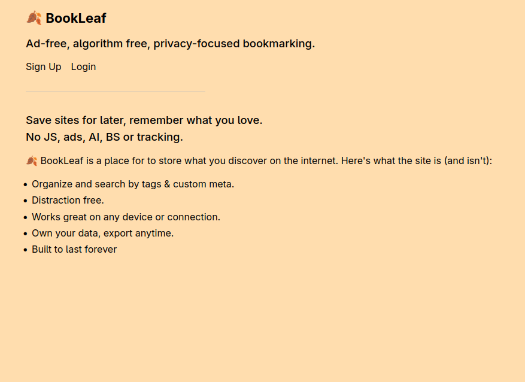
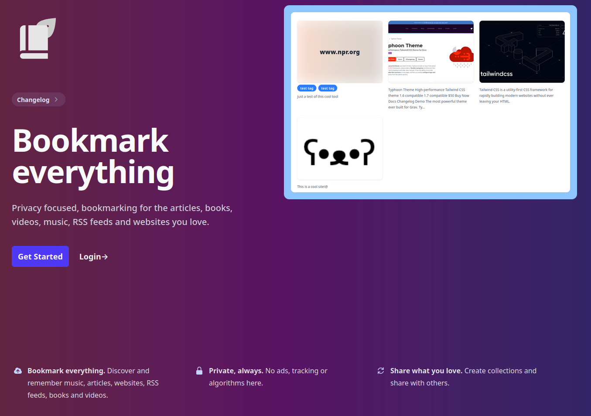
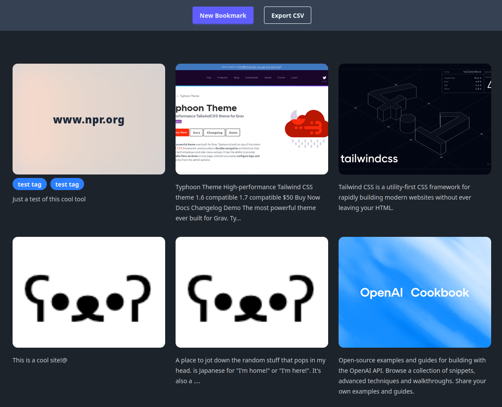
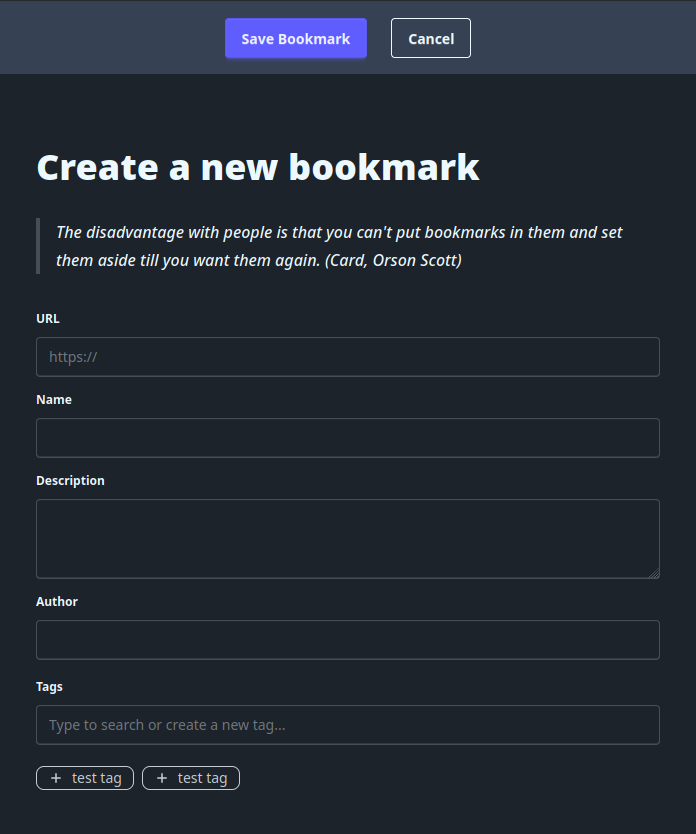

My original vision for BookLeaf was to keep it extremely simple, no CSS frameworks or JavaScript, pages so small they hardly register in the network tab. But I think I went a bit too far. Bookmarks are something that should be visual and unique, not a piece of toilet paper sticking out of the pages.

To align with this new vision, I've redesigned each page in BookLeaf. I'm going for a simple, but visual aesthetic that puts the focus on your content. Additionally, there's some big changes in the pipeline that this design will help facilitate!

### Technical

From a technical side, I've brought in TailwindCSS and DaisyUI. Yes, I could have hand rolled the CSS, but honestly I probably would have run out of steam in doing so. I'd rather focus on building, and using a framework let's me keep a consistent visual style. I do have concerns around page size, but so far everything is still fairly small thanks to tree shaking and minification. Another concern I have is a loss of visual identity. I don't want BookLeaf to look like "every other website". While this update does tip the needle closer to the norm, I think as a I continue to iterate a unique identity will evolve.

I've introduced HTMX in a few areas to improve the UX. Notably, HTMX is used to provide live scraping of websites as you fill out the bookmark form, and auto-suggest for tags. Again, I have concerns with bundle size and compatibility across older devices, but HTMX comes in at 14k and provides some huge improvements for UX.

### Folders

I have temporarily sidelined folders. This feature will make a return soon, but with a more visual interface. Until then, please continue to leverage tags to organize your bookmarks!

## Let's see it

The changes are live on [BookLeaf](https://bookleaf.dev)!

As always, feedback is more than welcome, use the button at the end of the article to send me an email!

### Screenshots

