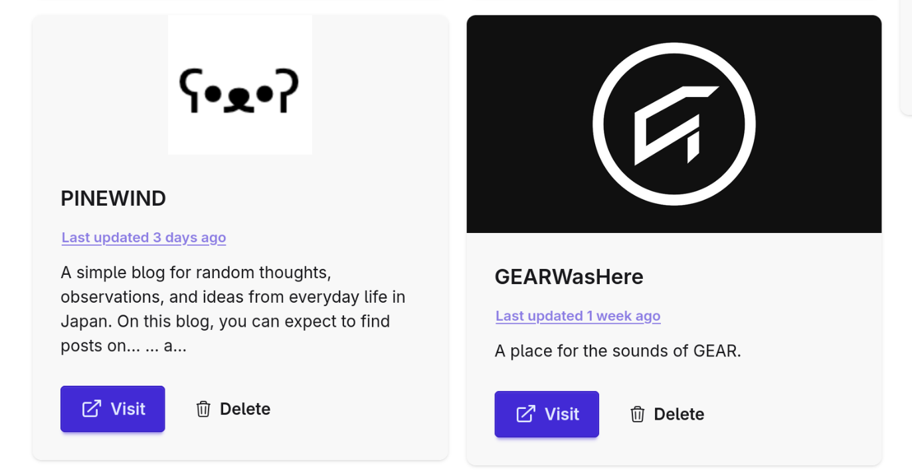

I've released initial support for RSS feeds in BookLeaf! With this first pass, BookLeaf will now automatically discover RSS feeds for a website when you create a bookmark. BookLeaf will then check the feeds twice a day, and use that information to show you when a site was last updated (with a link out to the latest post).

This is just the first pass of RSS in BookLeaf. Here's what's still to come:

- [ ] Ability to view all posts for RSS feeds
- [ ] Ability to turn off specific RSS feeds for a bookmark
- [ ] Ability to sort bookmarks by those recently updated

Hope you like this quick update, and as always, send any feedback or suggestions my way!