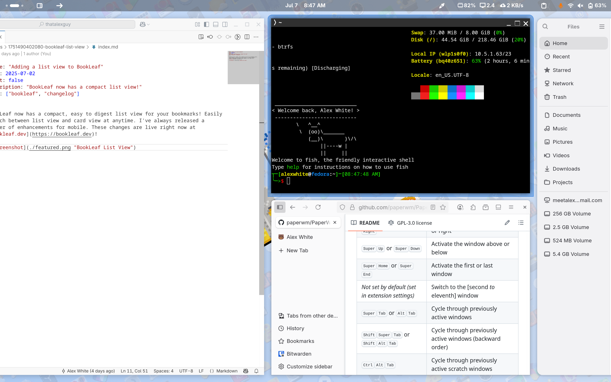
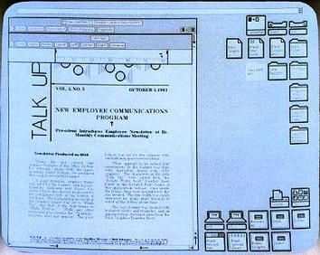
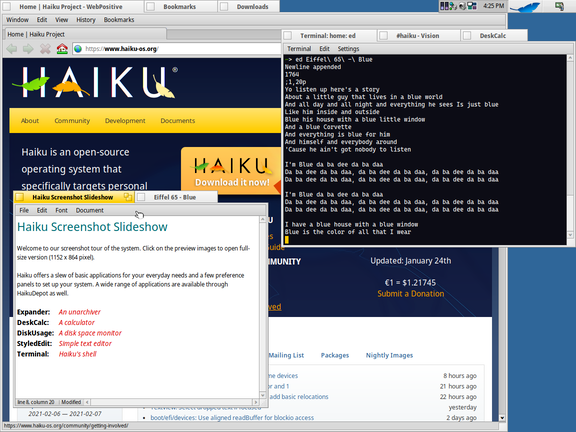
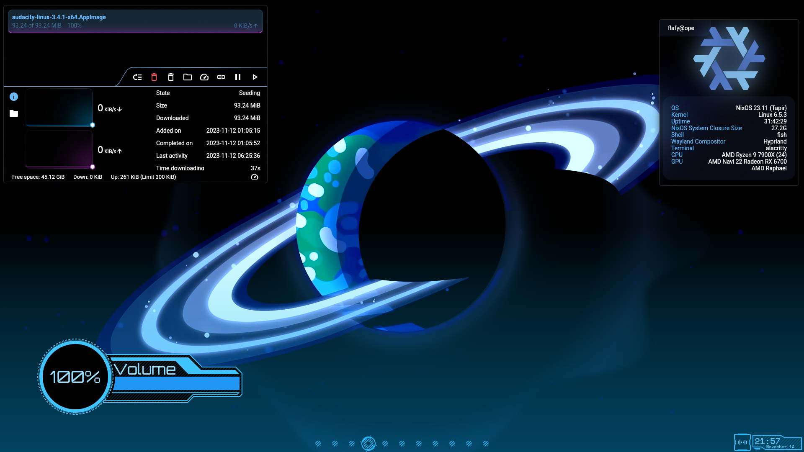
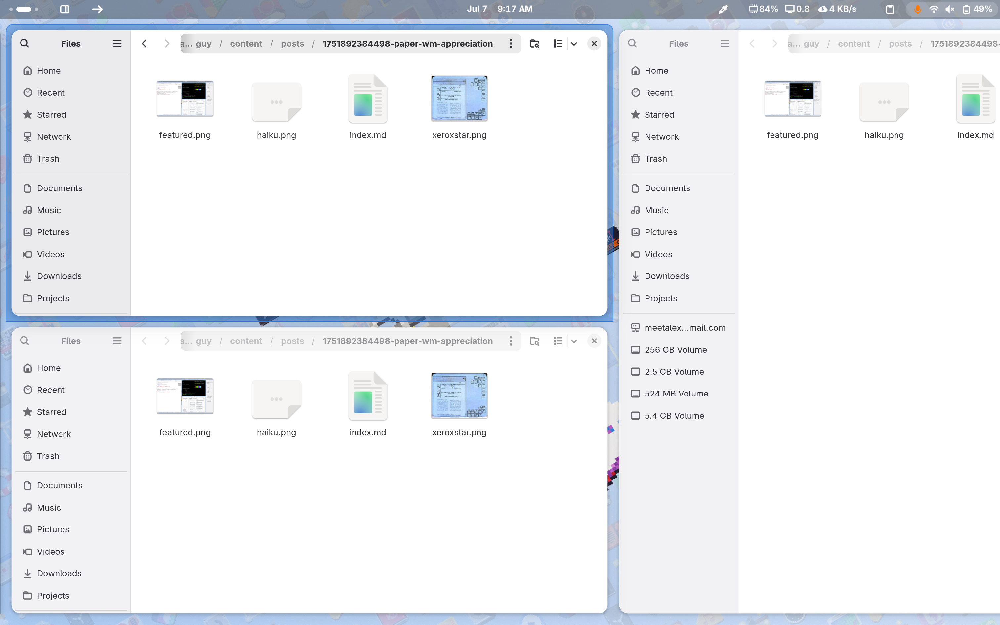

Earlier this year I (finally) made the complete switch to Linux, and since then I've been falling in love with how much cool software, extensions and tools there are in the FOSS world! Yesterday I stumbled upon PaperWM, a "tiled scrollable window management for GNOME" and just had to share this awesome tool.

## But first, a (brief) history of the desktop

When it comes to innovation in the desktop, there really hasn't been much since the Xerox Star in 1981. The traditional desktop is a skeuomorphic representation of a desk with papers and files on it. This has carried through the Apple Lisa in 1986, Windows 2.0 in 1987, GNOME 1 in 1997 and all the way to modern day operating systems. 

Throughout the history of the desktop, very few things have changed. You have files, folders and windows that stack as you open them. There's been a few twists, such as the stackable windows in BeOS or the virtual desktop paradigm in X11. But nothing has really shaken things up drastically.

## Something new

Modern tiling window managers offer probably the biggest shakeup to the desktop concept, automatically laying out your windows as you open them in order to make you more productive. Instead of CTRL+Tabbing between windows, or moving them around with your mouse, they smartly arrange themselves.

PaperWM feels like the evolution of tiling window managers, to me it's a "oh shit, why didn't that exisit before" moment.

## So what is it already??

The TL;DR of PaperWM is this: windows tile to the right, you horizontally scroll an endless row of windows to switch focus. You can tile windows vertically, swap windows within the horizontal scroll and resize windows. Scrolling can be done with the keyboard, or multitouch. PaperWM is technically an extension for GNOME 3, but it feels like a complete overhaul!

As someone who enjoys working on a single laptop screen (MacBook M1 Pro with Asahi Fedora), scrolling to change windows works really well, especially with touchpad gestures! It feels a lot more natural (and even faster) than switching virtual desktops, especially when resizing and changing the order of windows. That said, it does pair really well with GNOME's virtual desktops, turning them into something similiar to KDE's "Workspaces" for me. 



I have each virtual desktop assigned to a task (BookLeaf development, blog writing, etc). Within that virtual desktop, I can open new windows, sort them in my PaperWM row and simply scroll through it to jump between my terminal, browser, editor, etc.

## Sounds cool, how can I try it out?

If you run GNOME 3, simply [install the PaperWM extension](https://extensions.gnome.org/extension/6099/paperwm/). I recommend using the amazing [Extension Manager](https://flathub.org/apps/com.mattjakeman.ExtensionManager) application to make this process easy.

Not on GNOME 3? No problem! You can download [niri](https://github.com/YaLTeR/niri), a "scrollable-tiling Wayland compositor" inspired by PaperWM. This is a full Wayland desktop environment that you will select on login.

If you do give PaperWM a try, and want to geek out about how cool it is, send me an email!

