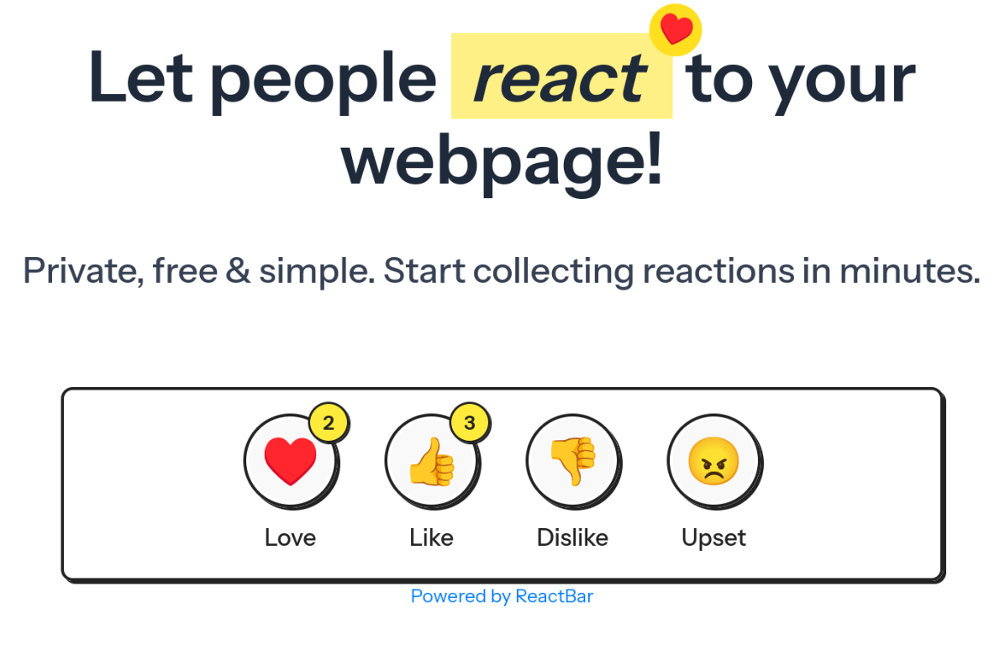

I've been looking at options for getting feedback on my blog posts. While I don't want to add comments (I'd much rather people email me and have a meaningful conversation), I did want a way to see if posts resonated with others. So like any good developer, I [built a service](https://reactbar.thatalexguy.dev) to solve my problem!

## Introducing ReactBar

ReactBar is a dead simple embed service to add reactions to a webpage. Enter a URL at the [ReactBar website](https://reactbar.thatalexguy.dev), get a `<script>` embed and paste into your HTML. That's it!

This is a super earlier release, but I figured I'd share it anyways. Here's what I'm planning in the future:

- [ ] Embeds go to the domain level instead of page level so you don't need a new embed code for each page
- [ ] An admin panel is available to view domain level and page level reaction stats
- [ ] You are able to configure which reactions are enabled at a sitewide or page level
- [ ] You are able to enable a second step feedback input, so users can leave feedback after reacting
- [ ] Light and dark themes

## Guiding priciples

ReactBar is aimed at the small web: independent websites/blogs/etc. With that in mind, ReactBar is being released as free, open-source software. Furthermore, it's lightweight and will always respect your privacy.

## Feedback?

I'd love any feedback or suggestions! Leave a reaction below, then shoot me an [email](mailto:alex.white@hey.com)!

